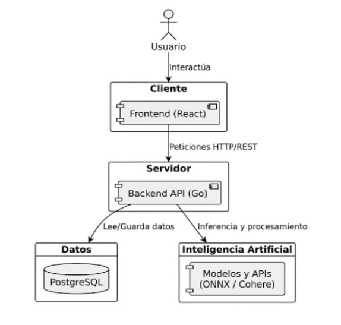

# System Architecture

## Overview

Stellart utilizes a **Client–Server architecture**, connecting a web frontend with a RESTful API.

The backend is structured using a **Layered Architecture**, which divides the system into the following logical layers:

### Controller Layer (`handler`)

Responsible for:

- Receiving HTTP requests via the Chi router.
- Validating inputs using DTOs.
- Formatting and returning responses.

### Business Logic Layer (`service`)

Contains:

- Core application logic.
- Business rules and workflows.

### Data Access Layer (`repository` and `database`)

Responsible for:

- Abstracting persistence operations.
- Implementing interfaces that interact directly with the PostgreSQL database hosted on Supabase.

### Domain Layer (`models` and `dto`)

Contains:

- Data structures.
- Domain entities.
- Objects used to communicate between application layers.

## Technologies Used

### Frontend

- **React (Vite)**
- **Tailwind CSS**

Used to build an agile, modular, and optimized user interface.

### Backend

- **Go (Golang)**

### Database

- **Supabase (PostgreSQL)**

Used to store application data consistently and reliably.

### Machine Learning

- **ONNX Runtime**

Integrated into the backend to locally execute the machine learning model responsible for detecting AI-generated artwork.

### Payments

- **Stripe**

Integrated to process and manage application payments.

## Architecture Diagram

### Components

#### User

Interacts with the platform through the frontend.

#### Client (Frontend / React)

- Renders the user interface.
- Sends HTTP/REST requests to the backend.

#### Server (Backend / Go)

- Processes requests.
- Executes business logic.
- Reads and stores data.
- Handles AI inference and processing tasks.

#### Data (PostgreSQL)

Provides persistent storage for application data.

#### Artificial Intelligence (ONNX / Cohere)

Provides models and APIs used for inference and AI-powered features.
